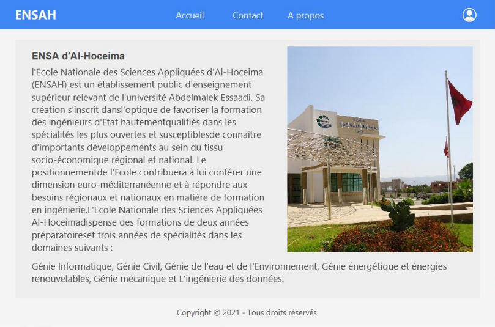
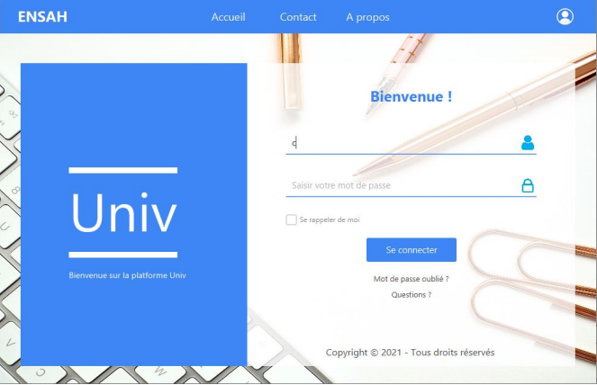
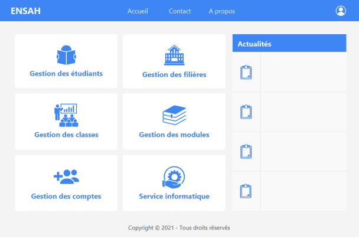
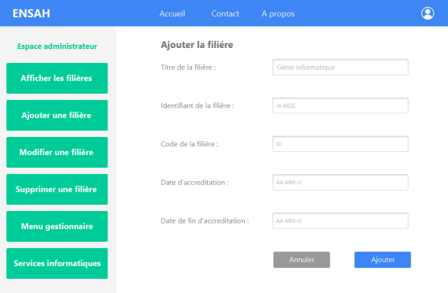
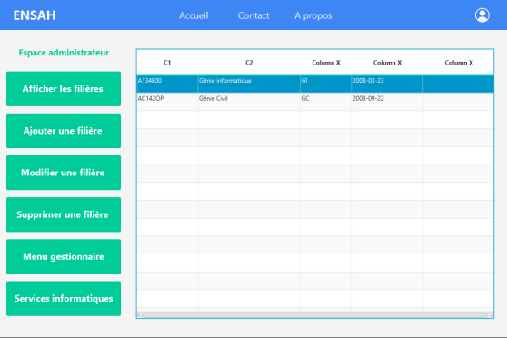
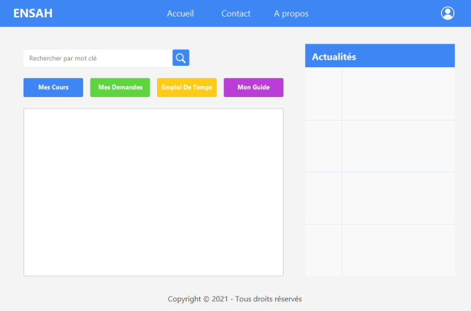

# schoolManagement_JavaFX
Creation of a desktop application of students and academic executives management as well as educational management.  Technologies : Java, JavaFx, MySQL.

## The graphical interface in JAVAFX:
JavaFX is a software platform for creating and delivering desktop applications, as well as rich web applications that can run on a wide variety of devices.
JavaFX supports desktop computers and web browsers on Microsoft Windows, Linux, and macOS, as well as mobile devices running iOS and Android. JavaFX was intended to replace Swing as the standard GUI library for Java SE, but it has been removed from new standard editions while Swing and AWT remain included, supposedly because JavaFX's market share has been " eroded by the rise of "mobile-first" and "web-first applications." With the release of JDK 11 in 2018, Oracle integrated JavaFX with OpenJDK as part of the OpenJFX project, to accelerate the pace of its development Oracle support for JavaFX is also available for Java JDK 8 until March 2025. Open-source JavaFXPorts works for iOS (iPhone and iPad) and Android and embedded (Raspberry Pi); and associated commercial software created under the name "Gluon" supports the same mobile platforms with additional features and desktop.[12] This allows a single source code base to build applications for desktop, iOS and Android.On desktop computers, JavaFX supports Windows Vista operating systems,
Windows 7, Windows 8, Windows 10, macOS and Linux. Starting with JavaFX 1.2, Oracle released beta versions for OpenSolaris. On mobile, JavaFX Mobile 1.x is capable of running on multiple mobile operating systems, including Symbian OS, Windows Mobile, and proprietary real-time operating systems.

## Screens from the app
### Home :

### Login :

### Admin interface :

### Students interface :
